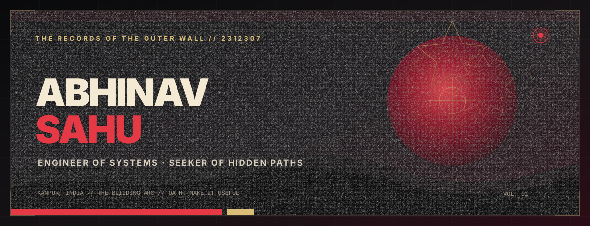

<!--
  Abhinav Sahu · GitHub Profile
  Built as a compact proof-of-work page, not a badge museum.
  Visual system: Obsidian / Bone / Signal Crimson.
-->

<p align="center">
  
</p>

<p align="center">
  <a href="https://abhinavsahu.me"></a>&nbsp;
  <a href="https://www.linkedin.com/in/abhinav-sahu-865a01297/"></a>&nbsp;
  <a href="https://leetcode.com/u/lucifer_debug/"></a>&nbsp;
  <a href="mailto:2k23.cs2312307@gmail.com"></a>
</p>

<p align="center">
  
</p>

<p align="center">
  
  
  
</p>

<br />

## `01 // MANIFESTO`

I build **full-stack products with an AI core**, especially where software meets an awkward real-world workflow. My favorite projects are useful before they are impressive: civic reporting, legal access, campus operations, travel assistance, and accessibility.

```ts
const abhinav = {
  role: "Full-stack developer + AI product builder",
  studying: "Computer Science @ PSIT Kanpur · 2027",
  currentlyExploring: ["agentic systems", "computer vision", "system design"],
  rule: "prototype fast, verify hard, ship the useful part"
};
```

<details>
<summary><b>Open the field dossier</b></summary>
<br />

- Building products across **TypeScript, React, Node.js, Python, FastAPI, and ML**
- **Rank 1**, GDGoC Full Stack Challenge
- Junior Frontend Developer, **Ignitia Web Team**
- Learning Japanese, currently targeting **JLPT N5**
- Debugging protocol: dark mode, low-fi, no mercy

</details>

<br />

## `02 // SELECTED TRANSMISSIONS`

<table>
<tr>
<td width="50%" valign="top">

### [AI Trip Concierge](https://github.com/Abhinav-2312307/AI-Trip-Concierge)

**Post-booking intelligence for hotel guests.** Context-aware itineraries, grounded local recommendations, transport guidance, and proactive alerts through an AI tool-calling layer.

`TypeScript` `React` `FastAPI` `AI Agents`

[](https://github.com/Abhinav-2312307/AI-Trip-Concierge)

</td>
<td width="50%" valign="top">

### [Nirikshan](https://nirikshan360.vercel.app/)

**A map-first civic accountability system.** Location-aware complaints, area quality overlays, reviews, lifecycle tracking, and analytics for public-space issues.

`JavaScript` `GeoJSON` `Maps` `Node.js`

[](https://nirikshan360.vercel.app/)
[](https://github.com/Abhinav-2312307/Nirikshan)

</td>
</tr>
<tr>
<td width="50%" valign="top">

### [JusticeAlly](https://justice-ally.vercel.app/)

**Legal complexity, translated.** An AI-assisted interface for understanding documents and exploring relevant Indian legal sections without drowning in jargon.

`TypeScript` `React` `NLP` `Node.js`

[](https://justice-ally.vercel.app/)
[](https://github.com/Abhinav-2312307/JusticeAlly)

</td>
<td width="50%" valign="top">

### [PrintMyPage PSIT](https://www.printmypagepsit.store)

**Campus printing without the queue chaos.** Upload, order, track, and collect documents through one focused student workflow.

`TypeScript` `Node.js` `Operations` `Email API`

[](https://www.printmypagepsit.store)
[](https://github.com/Abhinav-2312307/printmypagex)

</td>
</tr>
</table>

<p align="right"><a href="https://github.com/Abhinav-2312307?tab=repositories"><b>Explore all repositories →</b></a></p>

<br />

## `03 // OPERATING LOG`

<p align="center">
  
</p>

<br />

## `04 // SYSTEM LOADOUT`

<p align="center">
  
</p>

<p align="center">
  <code>PRODUCT ENGINEERING</code>&nbsp;&nbsp;·&nbsp;&nbsp;<code>AI INTEGRATION</code>&nbsp;&nbsp;·&nbsp;&nbsp;<code>COMPUTER VISION</code>&nbsp;&nbsp;·&nbsp;&nbsp;<code>GEOSPATIAL UX</code>
</p>

<br />

## `05 // TELEMETRY`

<p align="center">
  <picture>
    <source media="(prefers-color-scheme: dark)" srcset="https://github-readme-stats.vercel.app/api?username=Abhinav-2312307&show_icons=true&include_all_commits=true&hide_border=true&bg_color=0D1117&title_color=E63946&icon_color=FF6B35&text_color=C9D1D9&ring_color=E63946" />
    
  </picture>
  <picture>
    <source media="(prefers-color-scheme: dark)" srcset="https://streak-stats.demolab.com?user=Abhinav-2312307&hide_border=true&background=0D1117&ring=E63946&fire=FF6B35&currStreakLabel=E63946&sideLabels=C9D1D9&currStreakNum=F1FAEE&sideNums=C9D1D9&dates=8B949E" />
    
  </picture>
</p>

<p align="center">
  
</p>

<p align="center">
  
  
</p>

<details>
<summary><b>Release the contribution serpent</b></summary>
<br />
<p align="center">
  <picture>
    <source media="(prefers-color-scheme: dark)" srcset="https://raw.githubusercontent.com/Abhinav-2312307/Abhinav-2312307/output/github-snake-dark.svg" />
    <source media="(prefers-color-scheme: light)" srcset="https://raw.githubusercontent.com/Abhinav-2312307/Abhinav-2312307/output/github-snake.svg" />
    
  </picture>
</p>
</details>

<br />

## `06 // ESTABLISH CONTACT`

<p align="center">
  I like collaborations with a sharp problem, real users, and enough technical risk to be interesting.
  <br /><br />
  <a href="mailto:2k23.cs2312307@gmail.com"><b>EMAIL</b></a>
  &nbsp;·&nbsp;
  <a href="https://www.linkedin.com/in/abhinav-sahu-865a01297/"><b>LINKEDIN</b></a>
  &nbsp;·&nbsp;
  <a href="https://abhinavsahu.me"><b>PORTFOLIO</b></a>
  &nbsp;·&nbsp;
  <a href="https://github.com/Abhinav-2312307?tab=repositories"><b>PROJECTS</b></a>
</p>

<br />

<p align="center">
  <sub><code>IDEAS → SYSTEMS → IMPACT</code></sub><br />
  <sub>Designed and built by Abhinav Sahu.</sub>
</p>
